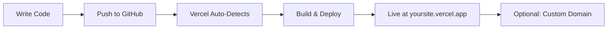

# Academic Portfolio Website — Full Analysis & Implementation Plan

## Executive Summary

Build a modern, high-performance academic portfolio website with **6 pages** (Home, About, Blog, Research, Publications, Contact) and deploy it **for free** on a world-class hosting platform.

---

## Part 1: Framework Analysis (Senior Dev Perspective)

I evaluated 4 major options. Here is my honest assessment:

### Option Comparison

| Criteria | **Next.js (React)** | **Astro** | **Vite + React** | **Hugo / Jekyll** |
|---|---|---|---|---|
| **Best For** | Full-stack apps, dashboards | Content-heavy sites, portfolios | Interactive SPAs | Simple static sites |
| **Performance** | ⭐⭐⭐⭐ (good, but ships more JS) | ⭐⭐⭐⭐⭐ (zero JS by default) | ⭐⭐⭐ (client-rendered) | ⭐⭐⭐⭐⭐ (pure HTML) |
| **SEO** | ⭐⭐⭐⭐⭐ (SSR/SSG) | ⭐⭐⭐⭐⭐ (static HTML) | ⭐⭐ (client-rendered, poor SEO) | ⭐⭐⭐⭐⭐ (static HTML) |
| **Blog/Markdown Support** | Needs MDX plugin setup | Native Content Collections | Manual setup required | Native (built for this) |
| **Learning Curve** | Moderate-High | Low-Moderate | Low | Low (but limited) |
| **Ecosystem** | Massive (React ecosystem) | Growing, excellent for content | React ecosystem | Limited to themes |
| **Flexibility** | Use React/Vue/Svelte components | Use ANY framework's components | React only | Template-based only |
| **Future-Proofing** | Industry standard | Rising fast, content-first web | Depends on React | Stagnating |

### ⭐ My Recommendation: **Next.js 15 (App Router + TypeScript)**

Here is my reasoning as a senior developer:

1. **Industry Standard**: Next.js is the most widely adopted React framework. Having a portfolio built in Next.js itself demonstrates your technical competency.
2. **Full-Stack Ready**: If you ever want to add a CMS, authentication, API routes, or dynamic features — Next.js scales seamlessly. Astro would require a rewrite.
3. **SEO Excellence**: Server-side rendering (SSR) and static site generation (SSG) give you perfect search engine indexing.
4. **Rich Ecosystem**: Thousands of UI libraries (shadcn/ui, Framer Motion, etc.) work out of the box.
5. **Vercel Hosting**: Next.js on Vercel is the gold standard — zero-config deployments with free tier.
6. **Career Value**: Recruiters and tech leads recognize Next.js expertise immediately.

> [!NOTE]
> If you prefer a lighter approach focused purely on content with minimal JavaScript, **Astro** would be the alternative. It ships zero JS by default and is specifically built for content-rich sites. Let me know if you'd prefer this route.

---

## Part 2: Technology Stack (Full Dependency List)

### Core Stack

| Layer | Technology | Purpose |
|---|---|---|
| **Framework** | Next.js 15 (App Router) | React-based framework with SSR/SSG |
| **Language** | TypeScript | Type safety, better DX, fewer bugs |
| **Styling** | Tailwind CSS v4 | Utility-first CSS, rapid UI development |
| **UI Components** | shadcn/ui | Beautiful, accessible, copy-paste components |
| **Animations** | Framer Motion | Smooth micro-animations and page transitions |
| **Icons** | Lucide React | Consistent, lightweight icon library |
| **Typography** | Google Fonts (Inter / Outfit) | Modern, professional typefaces |
| **Content** | MDX (Markdown + JSX) | Write blog posts and research in Markdown |
| **Forms** | React Hook Form + Zod | Type-safe contact form with validation |

### Full `package.json` Dependencies

```json
{
  "dependencies": {
    "next": "^15.x",
    "react": "^19.x",
    "react-dom": "^19.x",
    "framer-motion": "^12.x",
    "lucide-react": "^0.4x",
    "gray-matter": "^4.x",
    "next-mdx-remote": "^5.x",
    "react-hook-form": "^7.x",
    "@hookform/resolvers": "^3.x",
    "zod": "^3.x",
    "clsx": "^2.x",
    "tailwind-merge": "^2.x",
    "date-fns": "^4.x"
  },
  "devDependencies": {
    "typescript": "^5.x",
    "@types/react": "^19.x",
    "@types/node": "^22.x",
    "tailwindcss": "^4.x",
    "@tailwindcss/postcss": "^4.x",
    "eslint": "^9.x",
    "eslint-config-next": "^15.x"
  }
}
```

### What Each Dependency Does

| Package | Purpose | Size Impact |
|---|---|---|
| `next` | Core framework — routing, SSR, SSG, API routes | Framework (required) |
| `framer-motion` | Page transitions, scroll reveals, hover effects | ~33 KB gzipped |
| `lucide-react` | Tree-shakeable icons (only imports what you use) | ~2 KB per icon |
| `gray-matter` | Parses YAML frontmatter from Markdown files | ~5 KB |
| `next-mdx-remote` | Renders MDX content with custom components | ~8 KB |
| `react-hook-form` | Performant form state management | ~9 KB |
| `zod` | Schema validation for forms and content | ~13 KB |
| `clsx` + `tailwind-merge` | Conditional CSS class merging utility | ~1 KB |
| `date-fns` | Lightweight date formatting (vs. moment.js) | Tree-shakeable |

---

## Part 3: Free Hosting Comparison

### Platform Comparison (Free Tiers)

| Feature | **Vercel** ⭐ | **Netlify** | **Cloudflare Pages** | **GitHub Pages** |
|---|---|---|---|---|
| **Best For** | Next.js (native) | JAMstack sites | Static + Workers | Simple static HTML |
| **Bandwidth** | 100 GB/mo | 100 GB/mo | **Unlimited** | ~100 GB/mo |
| **Builds/mo** | ~6000 min | 300 min | 500 builds | No limit |
| **Serverless Functions** | ✅ (Edge + Node) | ✅ (Netlify Functions) | ✅ (Workers) | ❌ None |
| **Custom Domain** | ✅ Free | ✅ Free | ✅ Free | ✅ Free |
| **SSL/HTTPS** | ✅ Auto | ✅ Auto | ✅ Auto | ✅ Auto |
| **Preview Deploys** | ✅ Per PR | ✅ Per PR | ✅ Per PR | ❌ |
| **Analytics** | ✅ Built-in | ✅ (Paid) | ✅ Free | ❌ |
| **Image Optimization** | ✅ Native | ❌ (3rd party) | ❌ | ❌ |
| **Git Integration** | GitHub, GitLab, Bitbucket | GitHub, GitLab, Bitbucket | GitHub, GitLab | GitHub only |
| **Cold Start** | Minimal | Moderate | None (Edge) | N/A |

### ⭐ My Recommendation: **Vercel (Free Hobby Plan)**

- **Zero-config**: Push to GitHub → auto-deploys in seconds
- **Built by Next.js creators**: Perfect framework integration, image optimization, edge middleware
- **Free custom domain**: Connect your own `yourname.dev` or `yourname.com`
- **Preview deployments**: Every PR gets its own live URL
- **Speed Insights**: Built-in performance monitoring

> [!IMPORTANT]
> Vercel's free "Hobby" tier is for **personal, non-commercial use** — perfect for a portfolio. If this ever becomes a commercial site, Cloudflare Pages (unlimited bandwidth, no commercial restrictions) would be the better alternative.

---

## Part 4: Website Architecture

### Page Structure

```
📁 app/
├── 📄 page.tsx              → Home (Hero + Overview)
├── 📄 layout.tsx            → Root layout (Navbar + Footer)
├── 📁 about/
│   └── 📄 page.tsx          → About (Bio, Skills, Timeline)
├── 📁 blog/
│   ├── 📄 page.tsx          → Blog listing (all posts)
│   └── 📁 [slug]/
│       └── 📄 page.tsx      → Individual blog post
├── 📁 research/
│   └── 📄 page.tsx          → Research projects & interests
├── 📁 publications/
│   └── 📄 page.tsx          → Papers, journals, citations
├── 📁 contact/
│   └── 📄 page.tsx          → Contact form + social links
📁 content/
├── 📁 blog/                 → Markdown blog posts
├── 📁 research/             → Research project MDX files
└── 📁 publications/         → Publication data (JSON/MDX)
📁 components/
├── 📁 ui/                   → Reusable UI components
├── 📁 layout/               → Navbar, Footer, etc.
└── 📁 sections/             → Page-specific sections
```

### Page Details

| Page | Key Sections | Features |
|---|---|---|
| **Home** | Hero banner, Featured research, Recent publications, Blog highlights, CTA | Animated entry, particle/gradient background, typing effect |
| **About** | Bio, Education timeline, Skills grid, Awards, CV download | Interactive timeline, skill progress bars, downloadable PDF |
| **Blog** | Post listing with tags/categories, search, pagination | Markdown/MDX rendering, reading time, tag filtering |
| **Research** | Research interests, active projects, collaborations | Project cards with status badges, expandable details |
| **Publications** | Filterable publication list, citation counts | BibTeX export, DOI links, year/type filters, citation format toggle |
| **Contact** | Contact form, social links, office info, map embed | Form validation, success animation, email integration |

### Design Philosophy

- **Dark mode first** with light mode toggle
- **Glassmorphism** effects on cards and navigation
- **Smooth scroll-driven animations** (elements animate as they enter viewport)
- **Gradient accents** (deep purple → electric blue → cyan palette)
- **Micro-interactions** on every clickable element
- **Responsive** down to mobile 320px

---

## Part 5: Deployment Workflow



### Steps to Deploy:
1. Create a GitHub repository
2. Push the portfolio code
3. Sign up at [vercel.com](https://vercel.com) (free, use GitHub login)
4. Import the repository → Vercel auto-detects Next.js
5. Click **Deploy** → Live in ~60 seconds
6. (Optional) Add a custom domain in Vercel settings

---

## Open Questions

> [!IMPORTANT]
> Please help me decide on these before I start building:

1. **Framework Choice**: Do you want **Next.js** (my recommendation) or would you prefer **Astro** (lighter, content-focused)? Or a different framework?

2. **Styling**: Should I use **Tailwind CSS** (fast development, utility classes) or **Vanilla CSS** (full control, no framework dependency)?

3. **Color Scheme**: Do you prefer:
   - Dark mode with purple/blue gradients (modern, developer-aesthetic)
   - Clean white/light academic theme (traditional, professional)
   - Both with a toggle?

4. **Content**: Do you have existing content (bio, publications, blog posts) to pre-populate, or should I create placeholder content?

5. **Contact Form**: Do you want:
   - A simple `mailto:` link
   - A functional form using a free service (Formspree/Web3Forms)

6. **Hosting**: Are you okay with **Vercel** (my recommendation), or do you prefer GitHub Pages, Netlify, or Cloudflare Pages?

---

## Verification Plan

### Automated Tests
- Lighthouse audit for all 6 pages (target: 90+ on all metrics)
- `npm run build` — ensure zero build errors
- Mobile responsiveness test across breakpoints

### Manual Verification
- Visual review of all pages in browser
- Navigation between all pages
- Contact form submission test
- Dark/light mode toggle
- Blog post rendering from Markdown
- Deploy to Vercel and verify live URL
